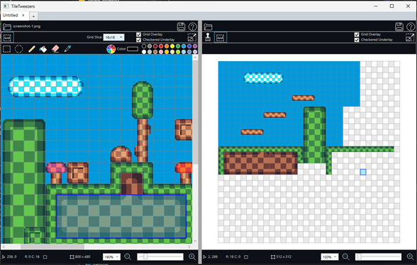

# TileTweezers
  
* Tilemap editor, under development, written in C# and WPF.  
* Currently only saves to .png. Future work will save to useful formats.

Features pending completion:
* Undo/Redo partially works
* Missing some keyboard shortcuts
* Save only to .png but should save to useful formats
* Tile rule painting would be nice
