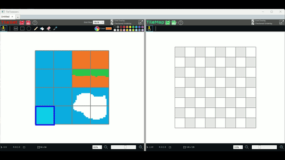
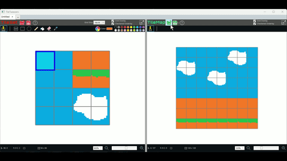
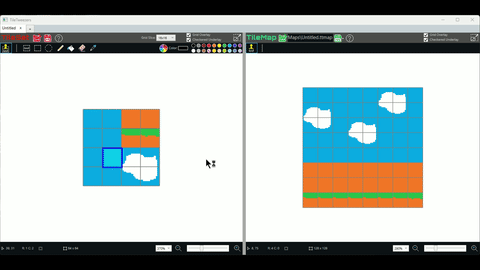

# TileTweezers
A simple yet powerful tilemap editor for game development, built with C# and WPF.
  
## How to use
TileTweezers is divided into a left and right side.  
The left side is where the tileset should be loaded from an existing image or painted using the paint tools.  
The right side is where the tilemap is created by stamping down what is Stamp selected on the left side.  

Follow these steps to get started:  

1)   On the left side, either draw a tileset using the paint tools or choose the "Open File" button and select an already made tileset image.
2) 
With the "Stamp Select" tool active, select the region on the left side of the user interface which has the tileset and move your cursor to the right side and stamp onto the tilemap.  
  
4) Move your cursor to the right side (the tilemap area). The selected region from the left side will appear under the cursor when the "Stamp Grid" tool  is chosen.
5) Click to stamp the image that appears under the cursor onto the tilemap.
6) Click the "Save" button  on the right side and choose a format to save your tilemap in. Currenlty our custom .ttmap is supported, as well as Tiled's .tmx format and also .png.  
### Save to ttmap format  
The .ttmap format is TileTweezer format that is simply a single file .zip containing the tileset image and a .json file.  
  
### Export to TMX & open with Tiled  
 

## About 
Tilemap editor, currently under active development, is written in C# and WPF.

Features Pending Completion:
* Layers are on the radar, but for now, only a single layer is supported.
* Missing some keyboard shortcuts for faster workflow.
* Currently saves only to our own .ttmap, Tiled's .tmx, and .png; will be expanded to include other useful formats.
* Planned feature: Advanced tile rule-based painting for automated map generation.

